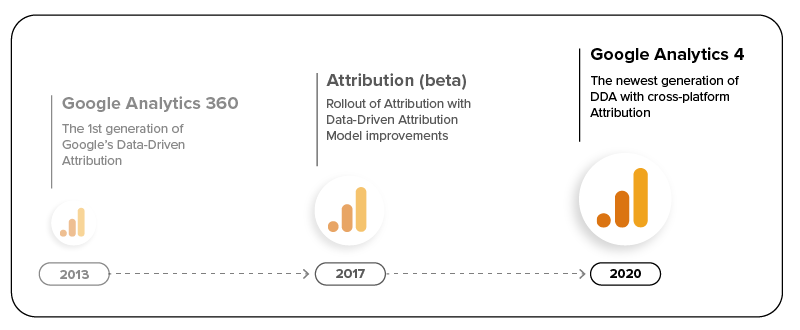
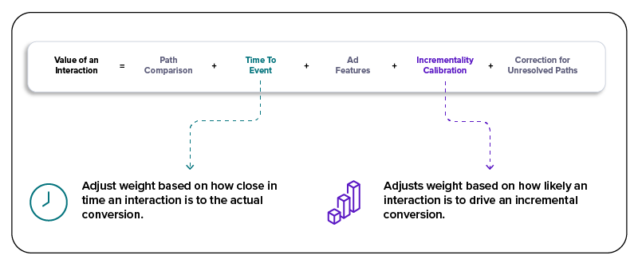
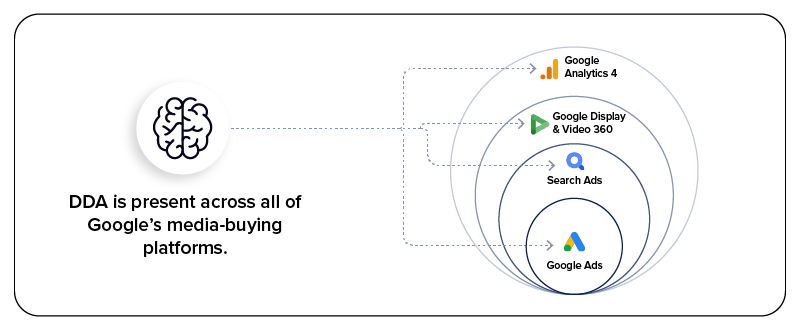

## What is Data-Driven Attribution (DDA)?

Before we begin, this post assumes that you are familiar with the concepts of [attribution](https://support.google.com/analytics/answer/10597962) in general and [data-driven attribution (DDA)](https://support.google.com/analytics/answer/10596866) in particular. However, if this isn’t the case, or if you’d just like a refresher on the two concepts, please see below:
<!--truncate-->
- The [Google Help Docs](https://support.google.com/analytics) define **attribution** as "*the act of assigning credit for conversions to different ads, clicks, and factors along a user’s path to completing a conversion.*"[1](https://support.google.com/analytics/answer/10597962)
- **Data-driven attribution** more specifically "*distributes credit for the conversion based on data for each conversion event. It’s different from the other models because it uses your account’s data to calculate the actual contribution of each click interaction.*"[2](https://support.google.com/analytics/answer/10596866)

## DDA Comparison: Universal Analytics (GA3) to GA4

### A Short History

In order to understand how DDA has improved from GA3 to GA4, it is important to know how DDA in Google Analytics has evolved over the years.

<b>DDA Lifecycle:</b>

As you can see, the first generation of DDA originated in Google Analytics 360 back [in 2013](https://martech.org/google-adds-data-driven-attribution-to-google-analytics-premium/), with the rollout of custom DDA models for GA360 accounts.

Then, in late 2017, Google launched [Attribution (beta)](https://support.google.com/analytics/topic/9397104), which offered free, cross-channel data-driven attribution to all customers. Attribution projects enabled brands to better understand their customer’s journey and get a consolidated view of digital performance with accurately reported conversions.

Now, with the formal launch of [GA4 in 2020](https://support.google.com/analytics/answer/9164320), not only is DDA freely available to all GA4 properties, but it is now set as the default attribution model. This means that for the first time, Google Analytics includes cross-channel, cross-platform DDA for everyone.

### Differences and Improvements

Arguably the **most crucial change from GA3 to GA4 is the elimination of almost all prerequisites and eligibility requirements.** In order to be [eligible for DDA in GA3](https://support.google.com/analytics/answer/3070276), organizations had to meet the following criteria:

- Be a GA360 customer,
- Have either e-commerce tracking or goals set up, and
- Have a Google Ads account with a minimum of 15,000 clicks and a conversion action with 600 conversions on Google Search within the last 30 days.

Additionally, in order to continue using the DDA model, an organization was required to maintain the following minimum thresholds within the last 28 days:

- 400 conversions per conversion action with at least 2 path interactions, and
- 10,000 paths within a selected reporting view.

In comparison, GA4, as mentioned above, is freely available to all customers, with DDA being the default attribution model for all properties. Furthermore, the only real remaining requirement for utilizing DDA in GA4 is to configure at least one event as a conversion event.

That means organizations no longer need to have a substantial volume of Google paid search clicks and conversions to qualify. Similarly, organizations don’t need to maintain those volumes over a rolling last 28-day period to remain eligible, and no longer need to have an external paid media conversion as the only available conversion event anymore. This elimination of minimum conversion thresholds, as we’ll discuss in a subsequent section, is a direct result of the improvements Google made to its data-driven attribution model.

Another notable change to DDA in GA4 comes with the functional improvements made to the underlying methodology. Firstly, there have been some major advancements in the DDA model’s methodology, involving the addition of two important factors: **Time To Event** and **Incrementality Calibration**.

<b>DDA Methodology:</b>

- **Time To Event** takes the relative time until conversion that a touchpoint has into account when assigning credit. Thus, "*in practice, this tends to mean that conversions occurring soon after an ad are more likely to have been caused by the ad (and therefore the ad tends to receive more credit) than conversions occurring long after the ad.*"[3](https://storage.googleapis.com/pub-tools-public-publication-data/pdf/78663d8e4eb78e887444ae53ab6a435ff2229dc5.pdf)

- **Incrementality** uses the results of holdback experiments to more accurately calculate the true incremental value of a specific interaction.

Furthermore, the new GA4 DDA model now takes the last 50 path interactions into consideration, whereas the old DDA model would only consider the last 4 interactions for assigning credit. Finally, the new DDA model gives you the option to choose between a 30, 60, and 90-day lookback window (set as default) for all conversion events. The one exception is Acquisition events (e.g. `first_open` and `first_visit`), which are set to a 30-day lookback window by default and can be manually switched to 7 days if preferred.

**For the Extra Curious**: If you would like to learn more about the underlying mathematical methodologies powering DDA, feel free to check out the following resources:

- [Shapley Value Methods for Attribution Modeling in Online Advertising](https://arxiv.org/abs/1804.05327)
- Google’s own [A Time To Event Framework For Multi-touch Attribution](https://storage.googleapis.com/pub-tools-public-publication-data/pdf/78663d8e4eb78e887444ae53ab6a435ff2229dc5.pdf)

## GA4 DDA: Use Case and Value

At this point, you may be asking yourself, "*Why should we even bother with using GA4 DDA when we already use another GMP product (e.g. Google Ads, SA360, or DV360) for attribution?*" While it’s certainly true that all three of these platforms already offer DDA for optimization and attribution of campaigns, GA4 was made to become the solution for true cross-channel, cross-platform, multi-touch attribution. In short, **GA4 is meant — and is especially well-suited — to serve as the single source of attribution truth.**

The current iteration of DDA in GA4 is not supposed to replace other Google platforms’ DDA offerings, but rather improves upon all three by incorporating them into its own model. A helpful way to think about it is to consider each platform (i.e. Google Ads, SA360, DV360, and GA4) as part of a series of concentric circles.

<b>DDA Hierarchy:</b>

Google Ads would be the smallest, least-informed DDA, while GA4 would be the largest circle that encompasses every other platform, making it the most informed, and thus most accurate, DDA model available. This in turn will help you improve the performance of your media investments across Google’s media-buying platforms by offering improvements in:

- **Attribution**: Apply best-in-class DDA model to GA4 exported conversions in Google Ads (incl. incrementality calibration, time-to-event, etc).
- **Smart Bidding**: Leverage GA4 exported conversion data with Google Ads DDA to help improve bidding and targeting, which subsequently [leads to better results](https://support.google.com/google-ads/answer/10762625).
- **Reporting**: Report GA4 conversion in Google Ads Attribution Reporting to drive DDA-based insights.

Furthermore, GA4 in and of itself can now serve as your single source of truth for attribution insights. This will not only help advertisers find and focus on the right data in order to meet key advertising objectives, but offer them the tools to make better decisions and truly measure the impact of their media investments.

## General Limitations of Attribution Models

Before we wrap up, we feel it is necessary to note that one should not take Google’s DDA capability as being the perfect solution for any and all attribution needs. Rather, we must first understand that "*all models are wrong, but some are useful,*" and acknowledge the general limitations of all attribution models.

For one, we know that **all models are only as good as the data they observe**, and any decline in observable/accurate data will inherently result in a decline in a model’s accuracy. Additionally, a model is based on the aggregation of all data it has to observe, so any non-occlusion of data will also inherently limit a model’s accuracy. Succinctly put, better input leads directly to better output.

Secondly, **attribution models still largely fail to account for offline-to-online effects**, regardless of following the recommended course of action of uploading and joining offline data with one’s GA4 data via [Data Import](https://support.google.com/analytics/answer/10071301). This means that there is likely to be an over-attribution of media effectiveness to online campaigns, and a simultaneous under- or non-attribution to offline campaigns.

Finally, and most importantly, is understanding the limitation that attribution models fail to account for those *immeasurable* contributions that influence marketing effectiveness, such as word of mouth, brand equity, and other external factors (e.g. macro-economic trends or seasonality).

However, with that being said, GA4’s DDA is arguably Google’s best attribution model available to date, and will only continue to improve as GA4 replaces the sunsetting GA3.

## A Look to the Future

As we look to the future of attribution, there is a clear understanding that **not only is GA4’s DDA an improvement from previous attribution models, but it is a necessary adoption for marketers in order to address this post-cookie and privacy-first world.** And at this point, you may be wondering what you can do to get ready for this shift.

That’s where we recommend getting started today with a dual setup, this means setting up a new GA4 property alongside your existing implementation. This approach will allow you to use your existing Analytics as your historic source of truth, all while capturing new data in GA4 in order to take advantage of the newest features and functionality as they become available. With GA3’s sunset date now [officially set](https://www.cardinalpath.com/blog/google-delays-universal-analytics-360-deprecation-to-july-1-2024) to July 1, 2023 (July 1, 2024 for GA360), it’s time to [start planning your migration](https://www.cardinalpath.com/blog/you-need-to-transition-to-google-analytics-4-now-heres-how-to-get-started) if you haven’t already.
