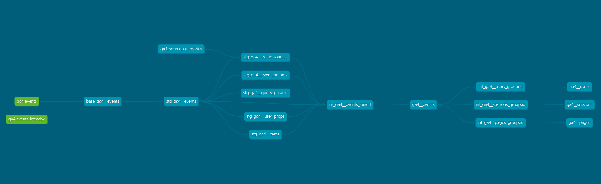

# Models

Here are the models included in this project.

:::caution
***These models are also not finalized & are likely to change.***
:::

## DAG Overview

:::caution
***This DAG Image is NOT current & will continue to CHANGE until all models are finalized.***
:::

## Mart Models

| Model Name | Description |
|------------|-------------|
| ga4__events | This is the table for event-level metrics & dimensions, that has been transformed to be wide & denomalized for easier quering. |
| ga4__pages | This is the table for page-level metrics & dimensions, such as `page_views`, `exits`, and `users`. This table is grouped by `page_title`, `event_date`, and `page_path`. |
| ga4__sessions | This is the table for session-level metrics & dimensions, such as `is_engaged_session`, `engagement_duration`, and `page_views`. This table is grouped by both `session_key` and `user_key`. |
| ga4__users | This is the table for user-level metrics & dimensions, such as `first` & `last_seen_date`, `geo`, and `traffic_source`. This table is grouped by the hashed `user_key` dimension, which is based on `user_id`, or `user_pseudo_id` if one doesn't exist. |

## Staging & Intermediate Models

| Model Name | Description |
|------------|-------------|
| stg_ga4__events | Creates a table with event data that is enhanced with useful `event_keys`, `page_keys`, `session keys`, and `user_keys`. |
| stg_ga4__event_params | Creates a table that unnests all of the event parameters specific to each event (e.g. `page_view`, `click`, or `scroll`), except for those marked in the `dbt_project.yml` file. |
| stg_ga4__traffic_sources | Creates a table that designates a `default_channel_grouping` via the `source`, `medium`, `campaign` columns. |
| stg_ga4__user_props | Creates a table that unnests the `user_properties`, except for those marked in the `dbt_project.yml` file. |
| stg_ga4__query_params | Maps any and all query parameters (e.g. `gclid`, `fbclid`, etc.) contained in each event's `page_location`. |
| stg_ga4__conversions | Creates a table for the events that you mark as a `conversion_event` in the `dbt_project.yml` file. |
| int_ga4__events_joined | ...[TO DO]... |
| int_ga4__pages_grouped | ...[TO DO]... |
| int_ga4__sessions_grouped | ...[TO DO]... |
| int_ga4__users_grouped | ...[TO DO]... |
